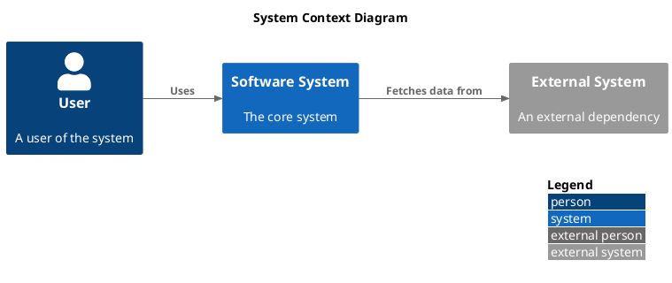
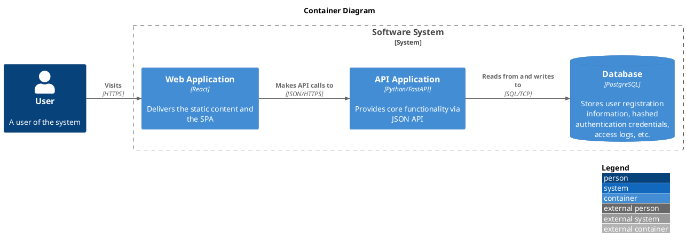
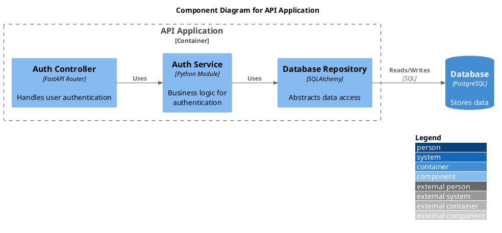

# Rules

All C4 PlantUML diagrams MUST start with `@startuml` and end with `@enduml`.
You MUST include the appropriate C4-PlantUML macro file directly after `@startuml`.

## Includes
- Context Diagram: `!include <C4/C4_Context>` (use angle-bracket stdlib syntax, NOT raw URLs)
- Container Diagram: `!include <C4/C4_Container>` (use angle-bracket stdlib syntax, NOT raw URLs)
- Component Diagram: `!include <C4/C4_Component>` (use angle-bracket stdlib syntax, NOT raw URLs)

**NEVER use `!include https://...` URLs.** Always use the built-in stdlib paths with angle brackets.

## FORBIDDEN Patterns
- Do NOT use hyphens (`-`) in PlantUML aliases. Replace any hyphens in
  canonical IDs with underscores (`_`). For example, `ENT-003` becomes
  `ENT_003` as the alias. PlantUML interprets hyphens as the minus operator,
  which causes `Syntax Error? (Assumed diagram type: activity)`.
- Do NOT use raw `rectangle` elements. ALWAYS use the C4 macros (`Person`, `System`, `Container`, `Component`, etc.).
- Do NOT manually construct stereotypes like `<<person>>`, `<<system_boundary>>`, or `<<external_system>>`.
- Do NOT attempt to replicate the expanded macro output — use the macro functions directly.
- Do NOT use `skinparam`, `sprite`, or low-level PlantUML constructs to emulate C4 styling.

## Element Macros
- `Person(alias, "Label", "Optional Description")`
- `System(alias, "Label", "Optional Description")`
- `System_Ext(alias, "Label", "Optional Description")`
- `Container(alias, "Label", "Technology", "Optional Description")`
- `ContainerDb(alias, "Label", "Technology", "Optional Description")`
- `Component(alias, "Label", "Technology", "Optional Description")`

## Relationship Arrows
- `Rel(from_alias, to_alias, "Label", "Optional Technology")`
- `Rel_U(from_alias, to_alias, "Label", "Optional Technology")` (Up)
- `Rel_D(from_alias, to_alias, "Label", "Optional Technology")` (Down)
- `Rel_L(from_alias, to_alias, "Label", "Optional Technology")` (Left)
- `Rel_R(from_alias, to_alias, "Label", "Optional Technology")` (Right)

## Layout Directives
- Place `LAYOUT_WITH_LEGEND()` near the end of the diagram.
- Place `LAYOUT_LANDSCAPE()` as the **very last macro** before `@enduml`. This is mandatory for every diagram.
- You may use `LAYOUT_TOP_DOWN()` or `LAYOUT_LEFT_RIGHT()` near the top.

# Context Example

# Container Example

# Component Example

