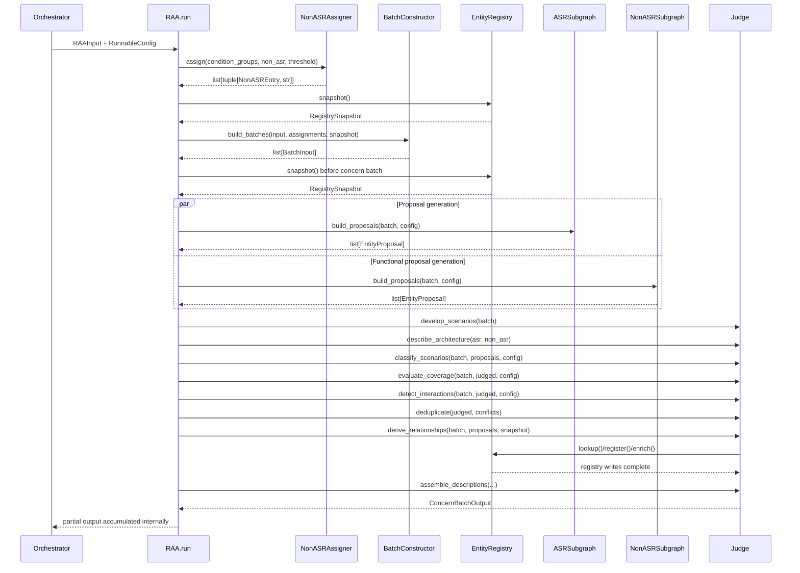
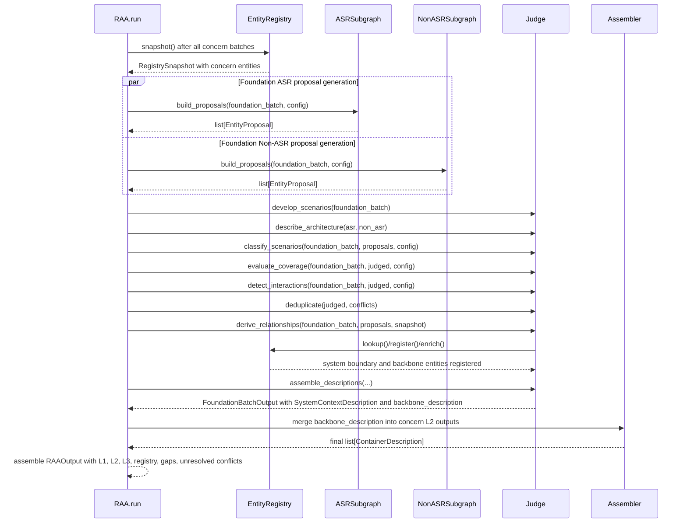

# RAA PRD — Phase 8: Method Signatures & Implementation Detail

**Version:** 1.0
**Status:** Final
**Depends on:** Phase 1-7

---

## 1. Scope

This phase is the final implementation specification for method signatures. It fixes
the callable surface for the public API, batch construction, subgraphs, Judge, registry,
and utilities. Nothing is deferred.

Type hints reference only:

- Phase 2 schemas: `RAAInput`, `RAAOutput`, `BatchInput`, `BatchOutput`, `ConcernBatchInput`,
  `FoundationBatchInput`, `ASREntry`, `NonASREntry`, `EntityProposal`, `JudgedProposal`,
  `RegistryEntry`, `RegistrySnapshot`, `RegistryDelta`, `Relationship`, `CoverageGap`,
  `ConflictRecord`, `ContainerDescription`, `ComponentDescription`,
  `SystemContextDescription`, `C4Type`
- Phase 3 config/runtime types already introduced: `RAAConfigSchema`, `RunnableConfig`
- Python stdlib types: `str`, `int`, `float`, `bool`, `object`, `list`, `dict`, `tuple`,
  `Literal`

LangChain structured-output usage follows the Phase 3 and Phase 7 pattern: nodes bind
runtime LLMs from `RunnableConfig`, return Phase 2-shaped data, and rely on explicit
RAA validators for business constraints.

---

## 2. Public API Methods

### 2.1 `RAA.run`

```python
class RAA:
    async def run(self, input: RAAInput, config: RunnableConfig) -> RAAOutput:
        """
        Pre:
            - `input` is the Orchestrator-produced RAAInput boundary object from
              Phase 1 §2.
            - `config["configurable"]` supplies the `RAAConfigSchema` keys required
              by Phase 3 §2.2 and Phase 7 §1.2: `asr_llm`, `non_asr_llm`,
              `judge_llm`, `thread_id`, and `db_path`.
            - The caller awaits this coroutine, preserving Phase 7 §1.1.

        Post:
            - Returns `RAAOutput` exactly as defined in Phase 2 §9.
            - Concern batches are processed sequentially, Foundation batch last
              (Phase 1 §6.3).
            - `l2_descriptions` include Foundation backbone containers merged into
              each concern L2 via Phase 2 §6.3 append_unique semantics.
            - `conflicts` contains only unresolved `ConflictRecord` entries.

        Side effects:
            - Creates or resumes LangGraph checkpoints under `thread_id` and `db_path`.
            - Mutates the live in-memory entity registry during Judge steps only.
            - Performs local embedding inference and LLM calls through configured models.
        """
```

This method implements the Orchestrator to RAA interface from Phase 7 §1.

### 2.2 `BatchConstructor.build_batches`

```python
class BatchConstructor:
    def build_batches(
        self,
        input: RAAInput,
        non_asr_assignments: list[tuple[NonASREntry, str]],
        registry_snapshot: RegistrySnapshot,
    ) -> list[BatchInput]:
        """
        Pre:
            - `input.condition_groups`, `input.concerns`, `input.non_asr`, and
              `input.quality_weights` are present per Phase 1 §2.
            - `non_asr_assignments` is exclusive: each `NonASREntry` appears in
              exactly one tuple, assigned to a concern batch id or `foundation_batch`
              per Phase 1 §6.4.
            - `registry_snapshot` is a frozen snapshot from `Registry.snapshot()`.

        Post:
            - Returns ordered `BatchInput` records: all `ConcernBatchInput` values
              first, then one `FoundationBatchInput`.
            - Each concern batch carries its ASRs, assigned non-ASRs, ARLO decisions,
              global quality weights, condition text, and supplied registry snapshot.
            - The Foundation batch carries conditionless ASRs, orphan non-ASRs,
              global quality weights, and supplied registry snapshot.

        Side effects:
            - None. This method constructs data only and does not read or write the
              live registry.
        """
```

This method implements the construction side of Phase 7 §3.1 step 1.

### 2.3 `NonASRAssigner.assign`

```python
class NonASRAssigner:
    def assign(
        self,
        condition_groups: list[dict[str, object]],
        non_asrs: list[NonASREntry],
        threshold: float,
    ) -> list[tuple[NonASREntry, str]]:
        """
        Pre:
            - `condition_groups` contains the Orchestrator boundary shape described
              by Phase 1 §2.1: `cluster`, `nominal_condition`, and ASR requirements.
            - `non_asrs` contains enriched functional requirements from Phase 2 §7.1.
            - `threshold` is the similarity cutoff from Phase 3 §4 and Phase 7 §5.1.

        Post:
            - Returns one tuple per non-ASR: `(non_asr, batch_id)`.
            - `batch_id` is the best matching concern batch when score > threshold;
              otherwise it is `foundation_batch`.
            - Assignment is exclusive and deterministic for identical embeddings.

        Side effects:
            - Performs local FastEmbed inference.
            - Does not call LLMs and does not mutate registry or graph state.
        """
```

This method implements Phase 1 §6.4 and Phase 7 §5.

---

## 3. Subgraph Methods

### 3.1 ASR Subgraph

```python
class ASRSubgraph:
    def assemble_prompt(self, batch: BatchInput) -> tuple[str, str]:
        """
        Pre:
            - `batch` is the current `ConcernBatchInput` or `FoundationBatchInput`.
            - `batch.registry_snapshot` is read-only.

        Post:
            - Returns `(system_prompt, user_prompt)` rendered from Phase 4 §2
              ASR templates and the naming partial from Phase 4 §5.
            - Concern batches include ASRs, quality weights, decisions, condition,
              and registry snapshot. Foundation batches omit concern-only fields.

        Side effects:
            - Reads prompt template files from `raa/prompts/`.
            - May use an in-memory template cache.
        """

    async def invoke_llm(
        self,
        prompt: tuple[str, str],
        config: RunnableConfig,
    ) -> object:
        """
        Pre:
            - `prompt` is the rendered system/user prompt pair.
            - `config["configurable"]["asr_llm"]` exists per Phase 3 §2.2.

        Post:
            - Returns the raw structured-output response object from the ASR LLM.
            - The response is not trusted until `parse_response()` validates it.

        Side effects:
            - Calls the configured ASR LLM.
            - Emits observability events required by Phase 7 §7.
        """

    def parse_response(self, response: object, batch: BatchInput) -> list[EntityProposal]:
        """
        Pre:
            - `response` is the raw ASR LLM structured response.
            - `batch.batch_id` is available for traceability logging.

        Post:
            - Returns validated `EntityProposal` records.
            - Every returned proposal has `proposing_subgraph == "asr"`.
            - Proposals violating Phase 2 [VALIDATE] tags or Phase 3 §6 validators
              are rejected before reaching the Judge.

        Side effects:
            - Logs rejected proposals and validation reasons.
        """

    async def build_proposals(
        self,
        batch: BatchInput,
        config: RunnableConfig,
    ) -> list[EntityProposal]:
        """
        Pre:
            - `batch` is ready for ASR processing.
            - `config` satisfies `RAAConfigSchema`.

        Post:
            - Returns ASR-derived entity proposals for the Judge.
            - Returns an empty list when no ASRs exist in the batch.

        Side effects:
            - Loads prompts, invokes the ASR LLM, validates output, and logs metrics.
            - Does not write to the registry.
        """
```

### 3.2 Non-ASR Subgraph

```python
class NonASRSubgraph:
    def assemble_prompt(self, batch: BatchInput) -> tuple[str, str]:
        """
        Pre:
            - `batch.non_asrs` is the functional requirement set assigned to this batch.
            - `batch.registry_snapshot` is read-only.

        Post:
            - Returns `(system_prompt, user_prompt)` rendered from Phase 4 §3
              Non-ASR templates and the naming partial from Phase 4 §5.
            - Prompt content excludes QA-weighted reasoning and ARLO decisions.

        Side effects:
            - Reads prompt template files from `raa/prompts/`.
            - May use an in-memory template cache.
        """

    async def invoke_llm(
        self,
        prompt: tuple[str, str],
        config: RunnableConfig,
    ) -> object:
        """
        Pre:
            - `config["configurable"]["non_asr_llm"]` exists per Phase 3 §2.2.

        Post:
            - Returns the raw structured-output response object from the Non-ASR LLM.

        Side effects:
            - Calls the configured Non-ASR LLM.
            - Emits observability events required by Phase 7 §7.
        """

    def parse_response(self, response: object, batch: BatchInput) -> list[EntityProposal]:
        """
        Pre:
            - `response` is the raw Non-ASR LLM structured response.

        Post:
            - Returns validated `EntityProposal` records.
            - Every returned proposal has `proposing_subgraph == "non_asr"`.
            - Empty `source_requirements`, invalid names, and invalid C4 suffixes are
              rejected per Phase 2 [VALIDATE] tags and Phase 3 §6.

        Side effects:
            - Logs rejected proposals and validation reasons.
        """

    async def build_proposals(
        self,
        batch: BatchInput,
        config: RunnableConfig,
    ) -> list[EntityProposal]:
        """
        Pre:
            - `batch` is ready for Non-ASR processing.

        Post:
            - Returns Non-ASR-derived proposals for the Judge.
            - Returns an empty list when `batch.non_asrs` is empty.

        Side effects:
            - Loads prompts, invokes the Non-ASR LLM, validates output, and logs metrics.
            - Does not write to the registry.
        """
```

---

## 4. Judge Methods

### 4.1 SAAM Step 1 — Scenario Development

```python
class Judge:
    def develop_scenarios(self, batch: BatchInput) -> list[ASREntry | NonASREntry]:
        """
        Pre:
            - `batch.asrs` and `batch.non_asrs` contain all requirements in scope.

        Post:
            - Returns a single ordered scenario list containing every batch requirement.
            - No requirement text is modified.

        Side effects:
            - None.
        """
```

### 4.2 SAAM Step 2 — Architecture Description

```python
    def describe_architecture(
        self,
        asr_proposals: list[EntityProposal],
        non_asr_proposals: list[EntityProposal],
    ) -> list[EntityProposal]:
        """
        Pre:
            - Inputs are validated proposal lists from the ASR and Non-ASR subgraphs.

        Post:
            - Returns the candidate architecture as ASR proposals followed by Non-ASR
              proposals, preserving provenance in `proposing_subgraph`.

        Side effects:
            - None.
        """
```

### 4.3 SAAM Step 3 — Scenario Classification

```python
    async def classify_scenarios(
        self,
        batch: BatchInput,
        proposals: list[EntityProposal],
        config: RunnableConfig,
    ) -> list[JudgedProposal]:
        """
        Pre:
            - `proposals` is the candidate architecture from `describe_architecture()`.
            - `config["configurable"]["judge_llm"]` exists.

        Post:
            - Returns one `JudgedProposal` per proposal.
            - `scenario_classification` is `direct` when explicitly required and
              `indirect` when implied by quality attributes or patterns (Phase 1 §8.4).

        Side effects:
            - Calls the Judge LLM with Phase 4 §4 prompts.
            - Does not write to the registry.
        """
```

### 4.4 SAAM Step 4 — Individual Scenario Evaluation

```python
    async def evaluate_coverage(
        self,
        batch: BatchInput,
        judged: list[JudgedProposal],
        config: RunnableConfig,
    ) -> tuple[list[JudgedProposal], list[CoverageGap]]:
        """
        Pre:
            - `judged` contains classified proposals from Step 3.

        Post:
            - Returns updated judged proposals with `satisfied_requirements` populated.
            - Returns one `CoverageGap` for each requirement with no satisfying proposal.
            - Coverage evaluation is semantic, not keyword-only, per Phase 4 §4.3.

        Side effects:
            - Calls the Judge LLM.
            - Does not write to the registry.
        """
```

### 4.5 SAAM Step 5 — Scenario Interaction

```python
    async def detect_interactions(
        self,
        batch: BatchInput,
        judged: list[JudgedProposal],
        config: RunnableConfig,
    ) -> tuple[list[JudgedProposal], list[ConflictRecord]]:
        """
        Pre:
            - `judged` contains coverage annotations from Step 4.

        Post:
            - Returns judged proposals with `conflicts_with` populated.
            - Returns `ConflictRecord` entries for authority conflicts, merges, and
              genuine unresolved conflicts.
            - Authority conflicts follow Phase 1 §7.4 Rule 3: ASR authority wins.

        Side effects:
            - Calls the Judge LLM.
            - Does not write to the registry.
        """
```

### 4.6 Post-SAAM Deduplication

```python
    def deduplicate(
        self,
        judged: list[JudgedProposal],
        conflicts: list[ConflictRecord],
    ) -> list[EntityProposal]:
        """
        Pre:
            - SAAM Steps 3-5 have completed.
            - Naming validators have enforced Phase 1 §7.5.

        Post:
            - Returns surviving proposals deduplicated by exact `proposed_name`.
            - Compatible duplicates merge `source_requirements` with append_unique
              semantics.
            - ASR proposals survive same-name authority conflicts.

        Side effects:
            - None.
        """
```

### 4.7 Post-SAAM Relationship Derivation

```python
    def derive_relationships(
        self,
        batch: BatchInput,
        proposals: list[EntityProposal],
        registry_snapshot: RegistrySnapshot,
    ) -> list[Relationship]:
        """
        Pre:
            - `proposals` are deduplicated surviving entities.
            - Registry lookups can resolve known canonical IDs by exact name match.

        Post:
            - Returns diagram relationships with natural key
              `(source_id, target_id, label)` per Phase 2 §3.1.
            - Relationships only reference entities that will exist in the registry
              after registration/enrichment.

        Side effects:
            - None.
        """
```

### 4.8 Post-SAAM Description Assembly

```python
    def assemble_descriptions(
        self,
        batch: BatchInput,
        proposals: list[EntityProposal],
        relationships: list[Relationship],
        registry_delta: RegistryDelta,
        coverage_gaps: list[CoverageGap],
        conflicts: list[ConflictRecord],
    ) -> BatchOutput:
        """
        Pre:
            - Registry writes for `proposals` have completed.
            - `registry_delta` records all new and enriched entries for this batch.

        Post:
            - Returns `ConcernBatchOutput` for concern batches.
            - Returns `FoundationBatchOutput` for the Foundation batch.
            - Concern outputs include L2/L3 descriptions; Foundation output includes
              L1 system context and backbone L2 description.

        Side effects:
            - None. The registry write is complete before this method runs.
        """
```

---

## 5. Registry Methods

```python
class EntityRegistry:
    def snapshot(self) -> RegistrySnapshot:
        """
        Pre:
            - Registry may be empty.

        Post:
            - Returns a deep frozen copy of live `dict[str, RegistryEntry]` and the
              last written batch id, per Phase 3 §7.3.

        Side effects:
            - None.
        """

    def register(self, entry: RegistryEntry) -> None:
        """
        Pre:
            - `entry.canonical_id` is not already present.
            - `entry.canonical_name`, `c4_level`, `c4_type`, `authority`, and
              `description` are first-write values.
            - Phase 1 §7.4 Rule 2 applies: no name match exists.

        Post:
            - Inserts `entry` keyed by `canonical_id`.
            - Immutable fields use Phase 2 §3.3 `never` semantics.

        Side effects:
            - Mutates the live registry.
        """

    def enrich(self, canonical_id: str, updates: RegistryEntry) -> None:
        """
        Pre:
            - `canonical_id` exists.
            - Phase 1 §7.4 Rule 1 applies: exact name match found.
            - `updates` does not attempt to overwrite immutable fields.

        Post:
            - Appends unique `source_requirements`.
            - Merges `variants` by batch id.
            - Never overwrites `canonical_name`, `authority`, or `description`,
              preserving Phase 2 §3.3 merge strategies.

        Side effects:
            - Mutates the live registry entry in place.
        """

    def lookup(
        self,
        canonical_id: str | None = None,
        canonical_name: str | None = None,
    ) -> RegistryEntry | None:
        """
        Pre:
            - At least one lookup key is supplied.

        Post:
            - Returns the matching `RegistryEntry`, or `None`.
            - `canonical_id` lookup is preferred when both keys are supplied.
            - `canonical_name` lookup uses exact string equality only, per Phase 1 §7.5.

        Side effects:
            - None.
        """
```

---

## 6. Utility Methods

### 6.1 Embedding Helpers

```python
def embed_texts(texts: list[str]) -> list[list[float]]:
    """
    Pre: `texts` may be empty.
    Post: Returns one embedding vector per text, preserving order.
    Side effects: Performs local FastEmbed inference only.
    """


def compute_group_vectors(condition_groups: list[dict[str, object]]) -> dict[int, list[float]]:
    """
    Pre: `condition_groups` contains Phase 1 §2.1 group dictionaries.
    Post: Returns mean ASR text vectors keyed by non-foundation cluster id.
    Side effects: Calls `embed_texts()`.
    """


def cosine_scores(
    vector: list[float],
    group_vectors: dict[int, list[float]],
) -> dict[int, float]:
    """
    Pre: `vector` and every group vector have equal dimensionality.
    Post: Returns similarity score by cluster id.
    Side effects: None.
    """
```

### 6.2 Naming Validators

```python
def is_pascal_case(name: str) -> bool:
    """Returns whether `name` satisfies Phase 1 §7.5 PascalCase."""


def expected_suffix(c4_type: C4Type) -> str:
    """Returns the mandatory suffix for `c4_type`, or empty string for actors."""


def has_correct_suffix(name: str, c4_type: C4Type) -> bool:
    """Returns whether `name` satisfies Phase 1 §7.5 suffix rules."""


def normalize_name(name: str, c4_type: C4Type) -> str:
    """
    Pre: `name` is PascalCase or can be deterministically suffix-normalized.
    Post: Returns normalized canonical name per Phase 3 §6.4.
    Side effects: None.
    """
```

### 6.3 Schema Validators

```python
def validate_entity_proposal(proposal: EntityProposal) -> EntityProposal:
    """Validates Phase 2 §4.1 fields and Phase 3 §6.3 business rules."""


def validate_registry_entry(entry: RegistryEntry) -> RegistryEntry:
    """Validates Phase 2 §3.3 registry invariants before write."""


def validate_registry_delta(delta: RegistryDelta) -> RegistryDelta:
    """Validates Phase 2 §7.1 new/enriched disjointness."""


def validate_relationship(relationship: Relationship) -> Relationship:
    """Validates Phase 2 §3.1 natural-key fields and label length."""


def validate_batch_input(batch: BatchInput) -> BatchInput:
    """Validates Phase 2 §7.2 discriminator and batch id rules."""


def validate_batch_output(output: BatchOutput) -> BatchOutput:
    """Validates Phase 2 §7.3 discriminator and description invariants."""


def validate_raa_output(output: RAAOutput) -> RAAOutput:
    """Validates Phase 2 §9 final output, including unresolved-only conflicts."""
```

---

## 7. Sequence Diagrams

### 7.1 Concern Batch Lifecycle



### 7.2 Foundation Batch Lifecycle with L1 Assembly



---

## 8. Completeness Checklist

| Method | Context Defined By |
|---|---|
| `RAA.run` | Phase 1 §2, Phase 2 §9, Phase 3 §2, Phase 7 §1 |
| `BatchConstructor.build_batches` | Phase 1 §6.2-6.3, Phase 2 §7.2, Phase 7 §3.1 |
| `NonASRAssigner.assign` | Phase 1 §6.4, Phase 3 §4-5, Phase 7 §5 |
| `ASRSubgraph.assemble_prompt` | Phase 1 §8.2, Phase 4 §2 |
| `ASRSubgraph.invoke_llm` | Phase 3 §2.3, Phase 4 §6, Phase 7 §6 |
| `ASRSubgraph.parse_response` | Phase 2 §4.1, Phase 3 §6, Phase 6 §2 |
| `ASRSubgraph.build_proposals` | Phase 1 §8.2, Phase 7 §3.1 |
| `NonASRSubgraph.assemble_prompt` | Phase 1 §8.3, Phase 4 §3 |
| `NonASRSubgraph.invoke_llm` | Phase 3 §2.3, Phase 4 §6, Phase 7 §6 |
| `NonASRSubgraph.parse_response` | Phase 2 §4.1, Phase 3 §6, Phase 6 §2 |
| `NonASRSubgraph.build_proposals` | Phase 1 §8.3, Phase 7 §3.1 |
| `Judge.develop_scenarios` | Phase 1 §8.4 Step 1 |
| `Judge.describe_architecture` | Phase 1 §8.4 Step 2 |
| `Judge.classify_scenarios` | Phase 1 §8.4 Step 3, Phase 2 §4.2 |
| `Judge.evaluate_coverage` | Phase 1 §8.4 Step 4, Phase 2 §8 |
| `Judge.detect_interactions` | Phase 1 §8.4 Step 5, Phase 2 §8 |
| `Judge.deduplicate` | Phase 1 §7.4, Phase 1 §8.4 post-SAAM |
| `Judge.derive_relationships` | Phase 2 §3.1, Phase 1 §8.4 post-SAAM |
| `Judge.assemble_descriptions` | Phase 2 §6-7, Phase 4 §6.2 |
| `EntityRegistry.snapshot` | Phase 2 §5, Phase 3 §7.3, Phase 7 §4.1 |
| `EntityRegistry.register` | Phase 1 §7.4 Rule 2, Phase 2 §3.3, Phase 7 §4.2 |
| `EntityRegistry.enrich` | Phase 1 §7.4 Rule 1, Phase 2 §3.3, Phase 7 §4.3 |
| `EntityRegistry.lookup` | Phase 1 §7.5, Phase 7 §4.4 |
| `embed_texts` | Phase 3 §4 |
| `compute_group_vectors` | Phase 1 §6.4, Phase 3 §4 |
| `cosine_scores` | Phase 3 §5 |
| `is_pascal_case` | Phase 1 §7.5, Phase 3 §6.3 |
| `expected_suffix` | Phase 1 §7.5 |
| `has_correct_suffix` | Phase 1 §7.5, Phase 2 [VALIDATE] tags |
| `normalize_name` | Phase 3 §6.4 |
| `validate_entity_proposal` | Phase 2 §4.1, Phase 3 §6 |
| `validate_registry_entry` | Phase 2 §3.3, Phase 3 §6 |
| `validate_registry_delta` | Phase 2 §7.1 |
| `validate_relationship` | Phase 2 §3.1 |
| `validate_batch_input` | Phase 2 §7.2 |
| `validate_batch_output` | Phase 2 §7.3 |
| `validate_raa_output` | Phase 2 §9 |

