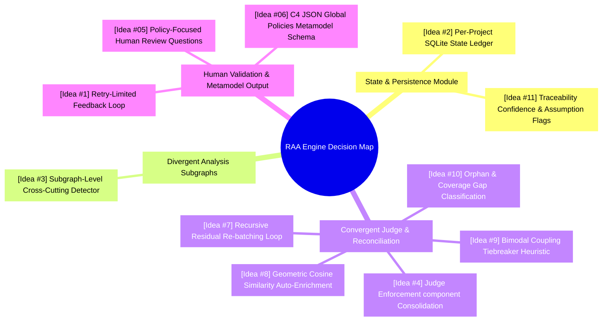
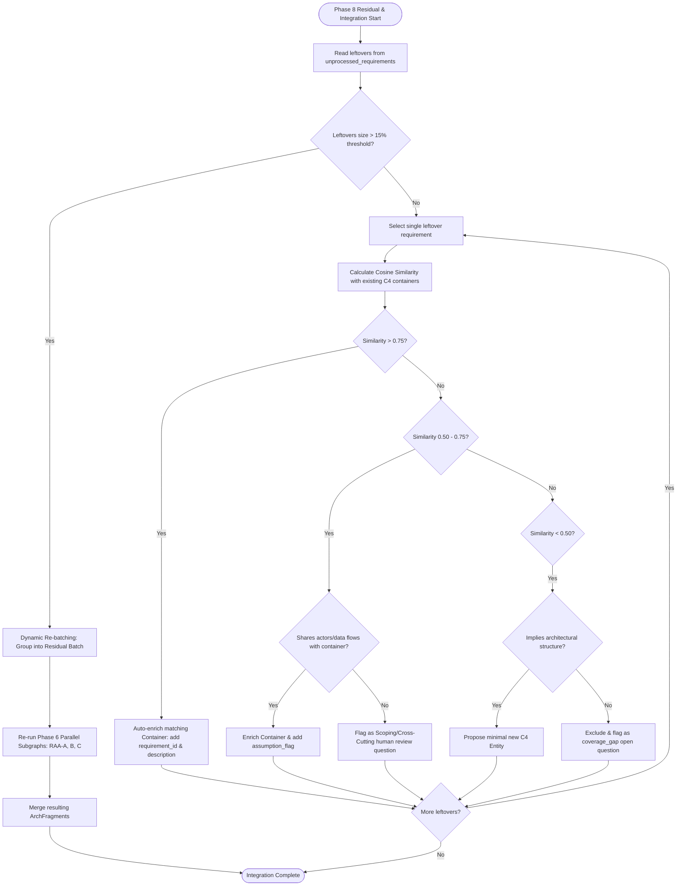
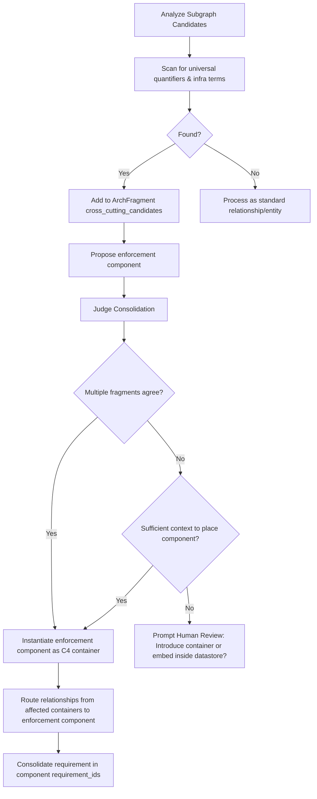
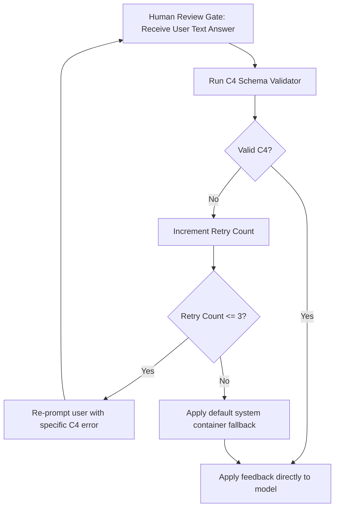

# Brainstorming Session Results

**Facilitator:** Delatom
**Date:** 2026-05-22 17:03:44

## Session Overview

**Topic:** Requirements Analysis Subgraph for Correct C4 Diagram Descriptions
**Goals:** Formulate logical decision-making strategies, validation rules, and mapping logic to enable enterprise-grade C4 diagrams by AGA

### Context Guidance

The input context is the RAA Module Specification (`raa_module_specification.md`). Key areas of focus for this brainstorming session include:
- **Parallel Subgraphs Integration:** Handling data flow between SAAM-first, Pattern-driven, and Entity-driven subgraphs.
- **Judge Reconciliation Logic:** Resolving container duplication and structural hierarchy conflicts.
- **Residual Requirements Pass:** Designing a robust Phase 8 pass for unprocessed requirements.
- **SQLite State Persistence:** Implementing lightweight SQLite persistence to bypass state size limits.

### Session Setup

We are using a **Progressive Technique Flow** for this brainstorming session. This structured flow will start with broad divergent thinking techniques to capture a wide field of ideas and progressively narrow down to coupons.

## Technique Selection

**Approach:** Progressive Technique Flow
**Journey Design:** Systematic development from exploration to action

**Progressive Techniques:**

- **Phase 1 - Exploration:** What If Scenarios for challenging RAA specification constraints.
- **Phase 2 - Pattern Recognition:** Mind Mapping for clustering generated ideas into RAA modules.
- **Phase 3 - Development:** SCAMPER Method for refining the architectural clusters.
- **Phase 4 - Action Planning:** Decision Tree Mapping for drafting the logic paths of the subgraph.

## Phase 1: Expansive Exploration (What If Scenarios)

We are capturing ideas systematically using the **IDEA FORMAT TEMPLATE**.

### Category 1: Human Feedback Integrity & Validation

**[Idea #1]**: [Retry-Limited Feedback Loop]
_Concept_: When human feedback violates C4 rules, the RAA Judge intercepts it, explains the specific violation (e.g., "System X does not exist"), and prompts the user for correction. The system permits a maximum of 3 retries; if the input remains invalid on the final retry, the Judge auto-heals by nesting the components under a default system fallback.
_Novelty_: Combines active user correction with a deterministic, non-crashing safety valve, preserving both user control and execution progress.

### Category 2: Local State & Resilience

**[Idea #2]**: [Per-Project SQLite State Ledger]
_Concept_: The RAA subgraph utilizes a SQLite database configured by the orchestrator on a per-project basis to persist both the 1024-dimensional vectors and the serialized outputs of individual subgraph nodes (SAAM, Pattern, Entity, Judge). When a run starts, the RAA checks the project-specific database for existing node checkpoints, resuming execution from the last successfully completed node and loading cached embeddings.
_Novelty_: Elevates SQLite from a simple vector store to a unified, project-isolated transaction ledger, decoupling the state of long-running LLM workflows from transient RAM and allowing clean session pausing/resuming.

### Category 3: Cross-Cutting Architectural Concern Promotion

**[Idea #3]**: [Subgraph-Level Cross-Cutting Detector]
_Concept_: Subgraphs (RAA-A, RAA-B, RAA-C) detect universal quantifiers ("all", "every") representing infrastructure-level concerns. Instead of applying annotations to all matching relationships, they place the requirement in a `cross_cutting_candidates` list in the `ArchFragment` and propose a single enforcement component (e.g., TLS Termination Gateway).
_Novelty_: Prevents database clutter by shifting from multi-edge annotation mapping to single enforcement node proposal at the edge of the analysis pipeline.

**[Idea #4]**: [Judge Enforcement Component Consolidation]
_Concept_: The Judge reconciles overlapping cross-cutting candidate requirements by instantiating the highest-scoring proposed enforcement component as a first-class C4 container/component. It then routes all relationships from affected entities to that enforcement component and consolidates the requirement inside that component's `requirement_ids` list.
_Novelty_: Operationalizes SAAM audit recommendations by promoting global annotations to concrete structural boundary components during the reconciliation phase.

**[Idea #5]**: [Policy-Focused Human Review Questions]
_Concept_: When the Judge cannot locate or create a suitable enforcement boundary for a cross-cutting candidate due to missing architectural context, it generates a high-context decision query for human review (e.g., "introduce a Replication Manager or implement CRDT inside each datastore?").
_Novelty_: Avoids silent fallbacks or diagram clutter by elevating unresolved cross-cutting concerns to strategic architectural choice prompts for the user.

**[Idea #6]**: [C4 JSON Global Policies Metamodel Schema]
_Concept_: The final merged model output (`arch_model.json`) is extended with a `global_policies` array that maps policy identifiers, original requirement IDs, and pointers to their C4 enforcement components. This enables the downstream AGA to render a clean, high-level diagram legend instead of repeating technology annotations across all arrows.
_Novelty_: Separates policy definition from execution boundaries in the C4 JSON metamodel, ensuring clean rendering and single-source requirement traceability.

### Category 4: Residual Processing Strategy

**[Idea #7]**: [Recursive Residual Re-batching Loop]
_Concept_: When the size of `unprocessed_requirements` at Phase 8 exceeds a threshold (e.g., 15% of total input requirements), the Judge triggers a recursive pass. It packages the leftovers into a new "Residual Batch" and feeds it back into the Phase 6 parallel execution subgraphs. The resulting `ArchFragments` are then merged into the main model using the standard Judge logic.
_Novelty_: Avoids forcing the Judge to make complex architectural design decisions in isolation by recursively leveraging the parallel subgraphs to structure leftover requirements.

**[Idea #8]**: [Geometric Cosine Similarity Auto-Enrichment]
_Concept_: For small leftover volumes, the Judge calculates the cosine similarity between the leftover requirement's embedding and the embeddings of all existing container descriptions using the local SQLite store. If similarity exceeds a high threshold (e.g., 0.75), it auto-associates the requirement to that container and enriches the metadata.
_Novelty_: Implements an automatic, zero-overhead semantic mapping pipeline by utilizing local embedding space properties.

**[Idea #9]**: [Bimodal Coupling Tiebreaker Heuristic]
_Concept_: For leftover requirements in the moderate similarity band (0.50 - 0.75), the Judge checks structural coupling evidence (e.g., whether the requirement references actors, external systems, or data flows shared by an existing container). If coupling aligns with similarity, it maps the requirement to the container.
_Novelty_: Uses multi-signal validation (geometric similarity + structural coupling) to make safer mapping decisions for ambiguous boundary elements.

**[Idea #10]**: [Orphan Classification & Coverage Gap Resolution]
_Concept_: For leftovers with low similarity (< 0.50), the Judge distinguishes between missing architecture (e.g., logging implying a Logging Service, prompting a new minimal container proposal) and non-architectural process/tooling rules (which are cleanly excluded and flagged as a "coverage gap" open question with a one-sentence rationale).
_Novelty_: Creates a principled ladder of fallback choices for orphaned requirements instead of relying on a single binary action.

**[Idea #11]**: [Traceability Confidence and Assumption Annotations]
_Concept_: Any container mapping done by the Judge purely through embedding similarity (without matching structural coupling evidence) is tagged with a reduced SAAM confidence score or an `assumption_flag`.
_Novelty_: Preserves the integrity of the C4 diagram traceability matrix by explicitly marking probabilistic inferences separately from deterministic ones.

## Phase 2: Pattern Recognition (Mind Mapping)

We are grouping our 11 ideas into four major logical modules that map directly to the RAA module architecture.



### Thematic Clusters:

1. **State & Persistence Module (SQLite Ledger & Metadata)**
   * **[Idea #2]**: Per-Project SQLite State Ledger (Checkpointing)
   * **[Idea #11]**: Traceability Confidence and Assumption Annotations (Confidence tracking)

2. **Divergent Analysis Subgraph Module (Phase 6 Parallel Paths)**
   * **[Idea #3]**: Subgraph-Level Cross-Cutting Detector (Early detection of global concerns)

3. **Convergent Judge & Reconciliation Module (Phase 6 Judge & Phase 8 Final Merge)**
   * **[Idea #4]**: Judge Enforcement Component Consolidation (Promoting annotations to C4 containers)
   * **[Idea #7]**: Recursive Residual Re-batching Loop (Iterative processing of leftovers)
   * **[Idea #8]**: Geometric Cosine Similarity Auto-Enrichment (Automatic mapping threshold)
   * **[Idea #9]**: Bimodal Coupling Tiebreaker Heuristic (Structural coupling confirmation)
   * **[Idea #10]**: Orphan Classification & Coverage Gap Resolution (Classification ladder)

4. **Human Interaction & Schema Validation Module (Phase 7 Review Gate & Output)**
   * **[Idea #1]**: Retry-Limited Feedback Loop (C4 constraint checking for user text inputs)
   * **[Idea #5]**: Policy-Focused Human Review Questions (High-context design decision prompts)
   * **[Idea #6]**: C4 JSON Global Policies Metamodel Schema (Legend-based output layout)

## Phase 3: Idea Development (SCAMPER Method)

We are refining our clustered ideas using SCAMPER lenses (Substitute, Combine, Adapt, Modify, Put to other uses, Eliminate, Reverse) to build implementation depth.

### Substitute & Combine

**[Idea #12]**: [Multi-Graph Isolated Subgraph Abstraction]
_Concept_: Implement RAA-A, RAA-B, and RAA-C as fully encapsulated, independent LangGraph instances with private state schemas, memory, and checkpoint boundaries. The main RAA orchestrator graph calls these subgraphs as parallel nodes, mapping parent state variables to their inputs and receiving final `ArchFragments` on completion, preventing internal state collision or memory bloat.
_Novelty_: Replaces a monolithic graph structure with modular, isolated subgraphs, making parallel execution and testing highly robust and maintaining strict encapsulation of agent reasoning.

**[Idea #13]**: [WAL-Enabled Multi-Session Checkpointer]
_Concept_: The RAA subgraph and its subgraphs utilize separate SQLite checkpoint databases with Write-Ahead Logging (WAL) enabled. This allows concurrent read/write operations during the parallel execution of the three subgraph nodes without causing lock delays or database corruption.
_Novelty_: Solves parallel database write contention on the local desktop filesystem by configuring WAL-mode transactional state persistence across isolated graph checkpointers.

### Modify & Adapt

**[Idea #14]**: [C4 Boundary Grouping Generation]
_Concept_: Instead of merging semantically similar containers (which destroys architectural intent like CQRS separation), the Judge clusters containers with 0.60 - 0.80 similarity and overlapping requirement IDs into C4 boundary groupings. These groupings are outputted in the C4 JSON metamodel to enable the downstream AGA to draw logical boundary lines around containers on the same canvas.
_Novelty_: Improves visual readability and diagram organization without destroying physical deployment unit separation or requirement traceability.

**[Idea #15]**: [Conservative Auto-Deduplication Engine]
_Concept_: The RAA Judge restricts auto-merging to cases with extremely high semantic similarity (> 0.80) and matching requirement IDs during Phase 6c. In all moderate-similarity cases, the default is to keep containers separate, generate logical C4 boundary groupings, and log an `assumption_flag` for traceability.
_Novelty_: Replaces destructive clustering with a conservative, traceability-preserving hierarchy that prioritizes structural fidelity over arbitrary canvas-fitting.

**[Idea #16]**: [High-Coupling Consolidate-or-Separate Query]
_Concept_: If two containers share moderate similarity (0.60 - 0.80) and overlapping requirement IDs, but their structural roles remain ambiguous, the Judge flags them for human review with a specific "consolidate or separate" prompt (e.g. "Confirm if container X and Y represent distinct deployment units or should be consolidated").
_Novelty_: Transforms vague complexity warnings into highly specific design decisions for the human reviewer.

## Phase 4: Action Planning (Decision Tree Mapping)

We have mapped the logical decisions of the RAA engine into three distinct execution trees to guide implementation.

### 1. Residual Requirements Integration Flow

This flowchart represents the Judge's logic ladder for handling leftovers under Phase 8.



### 2. Cross-Cutting Concern Promotion Flow

This flowchart outlines the early detection, consolidation, and output of global policies.



### 3. Human Feedback Loop Validation Flow

This flowchart structures the retry-limited validation logic inside the Phase 7 Review Gate.


```

## Idea Organization and Prioritization

### Prioritization Assessment

#### Top 3 High-Impact Ideas
1. **[Idea #15] Conservative Auto-Deduplication Engine:**
   * *Rationale:* The SAAM Audit measured this failure concretely: 7 duplicate container groups in a 50-requirement test, inflating the model from ~25 to 35 containers. Since every downstream artifact AGA produces is built on top of this model, a bloated, redundant entity graph corrupts all subsequent diagrams. Limiting auto-merging to >0.80 similarity preserves CQRS and intentional architectural separations.
2. **[Idea #4] Judge Enforcement Component Consolidation:**
   * *Rationale:* Cross-cutting concerns stamped onto dozens of relationships destroy requirement traceability, as the same requirement_id appears everywhere and points to nothing specific. This addresses SAAM Audit recommendation #3, restoring readability and clean diagram output.
3. **[Idea #10] Orphan Classification and Coverage Gap Resolution:**
   * *Rationale:* Section 12.5 of the spec makes this a hard contractual requirement — every input requirement must appear in exactly one of: a batch, the unprocessed queue, or a coverage_gap open question. A principled decision ladder prevents the Judge from silently dropping requirements or forcing them into the model inappropriately.

#### Easiest Quick Wins
1. **[Idea #3] Subgraph-Level Cross-Cutting Detector:**
   * *Rationale:* A simple prompt addition and pattern check for universal quantifiers against an infrastructure vocabulary. Requires no new infrastructure or schema changes, only adding a `cross_cutting_candidates` array to the existing `ArchFragment`.
2. **[Idea #11] Traceability Confidence and Assumption Annotations:**
   * *Rationale:* The `assumption_flag` already exists in the spec's OpenQuestion schema. This purely enforces that any mapping driven by geometric similarity (without coupling evidence) carries this flag.
3. **[Idea #2] Per-Project SQLite State Ledger:**
   * *Rationale:* SQLite is already the persistence layer. Project isolation is fundamentally a configuration and path-scoping change in the orchestrator injection so runs do not bleed into each other.

#### Most Innovative Approaches
1. **[Idea #7] Recursive Residual Re-batching Loop:**
   * *Rationale:* Feeding unprocessed requirements back through the parallel subgraphs recursively leverages the design intelligence of the subgraphs rather than forcing the Judge to make complex architectural decisions in isolation.
2. **[Idea #6] C4 JSON Global Policies Metamodel Schema:**
   * *Rationale:* Extends the ER-based C4 model with a top-level `global_policies` array pointing to enforcement components. This keeps requirement traceability intact and provides a clean contract for AGA to render policy legends.
3. **[Idea #9] Bimodal Coupling Tiebreaker Heuristic:**
   * *Rationale:* A multi-signal inference system using structural coupling (shared requirement_ids, actors, flows) as a tiebreaker for moderate geometric similarity scores, preventing over-reliance on a single dimension of evidence.

---

### Action Planning

#### Action Plan 1: Conservative Auto-Deduplication Engine (Idea #15)
* **Why This Matters:** Reclaims model readability by preventing container bloat while preserving intentional architectural separations.
* **Next Steps:**
  1. Define a semantic similarity check node in Phase 6c.
  2. Implement cosine similarity calculations on SQLite-cached container description embeddings.
  3. Enforce a `0.80` similarity threshold for auto-merging container definitions, otherwise keep separate or flag for human review.
* **Resources Needed:** SQLite embedding query function, similarity evaluation node.
  * **Timeline:** 1-2 developer days.
  * **Success Indicators:** Deduplicates redundant container proposals in regression testing while preserving CQRS designs.

#### Action Plan 2: Judge Enforcement Component Consolidation (Idea #4)
* **Why This Matters:** Promotes global annotations to concrete structural boundary components, cleaning up relationship arrows and enabling legend rendering.
* **Next Steps:**
  1. Build a Judge consolidation step that checks `cross_cutting_candidates` arrays in incoming ArchFragments.
  2. If multiple subgraphs agree, instantiate the proposed enforcement component (e.g., API Gateway) as a first-class C4 container.
  3. Route affected relationship arrows to point directly to this component.
* **Resources Needed:** Relationship re-routing logic, C4 JSON metamodel update.
  * **Timeline:** 2-3 developer days.
  * **Success Indicators:** Global policy requirements appear once inside an enforcement component rather than on every arrow.

#### Action Plan 3: Orphan Classification & Coverage Gap Resolution (Idea #10)
* **Why This Matters:** Ensures hard compliance with the specification's 100% requirements coverage rule (Section 12.5).
* **Next Steps:**
  1. Implement the decision ladder (similarity > 0.75 auto-maps; similarity 0.50-0.75 checks coupling; similarity < 0.50 classifies orphan type).
  2. If similarity < 0.50 and represents an architectural concern, propose a minimal entity. Otherwise, mark as `coverage_gap` with a one-sentence rationale.
* **Resources Needed:** Coupling checker logic, classification heuristics engine.
  * **Timeline:** 2 developer days.
  * **Success Indicators:** 100% of input requirements map to batches, entities, or coverage gaps with zero silent drops.

#### Action Plan 4: Subgraph-Level Cross-Cutting Detector (Idea #3)
* **Why This Matters:** Acts as the low-effort, high-leverage gateway for early detection of global policy candidates.
* **Next Steps:**
  1. Modify prompts for subgraphs RAA-A, B, and C to identify universal quantifiers ("all", "every") matching infrastructure terms.
  2. Extend `ArchFragment` output schema with a `cross_cutting_candidates` array.
* **Resources Needed:** Prompt tuning, JSON schema updates.
  * **Timeline:** 1 developer day.
  * **Success Indicators:** Subgraphs successfully output lists of proposed policy components.

---

## Session Summary and Insights

### Key Achievements
* **16 Structured Ideas Generated:** Developed robust design strategies for human feedback validation, local checkpointing, cross-cutting concern handling, and residual mapping.
* **Principled Heuristics Formulated:** Designed a bimodal decision ladder for leftovers and a conservative threshold system to prevent destructive auto-merging of CQRS designs.
* **C4 Metamodel Extension:** Formulated a clean legend-based rendering contract for global policies.
* **Actionable Roadmaps Created:** Formed 4 clear development plans mapping directly to RAA requirements.

### Session Reflections
The collaborative exploration was highly successful because we challenged the baseline assumptions of the ARLO-RAA-AGA boundaries. Grounding the "manifest constraint" as a readability concern rather than a simple mathematical limit unlocked the C4 boundary grouping concept, representing a major design breakthrough for visual quality.
